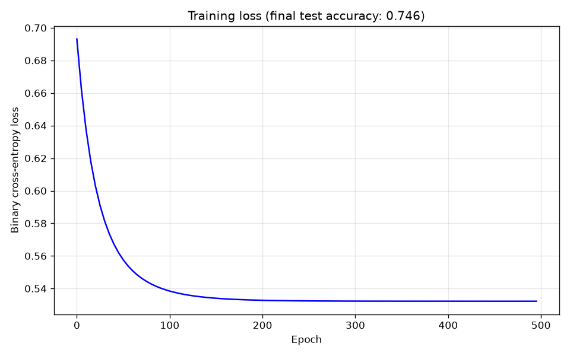

## Workflow

Install the Python dependencies:

```bash
pip install numpy pandas matplotlib
```

Run the complete training and export workflow from the repository root:

```bash
python3 trainer/generate_data.py
python3 trainer/train.py
python3 trainer/plot_loss.py
python3 trainer/export_weights.py
```

## Training loss


